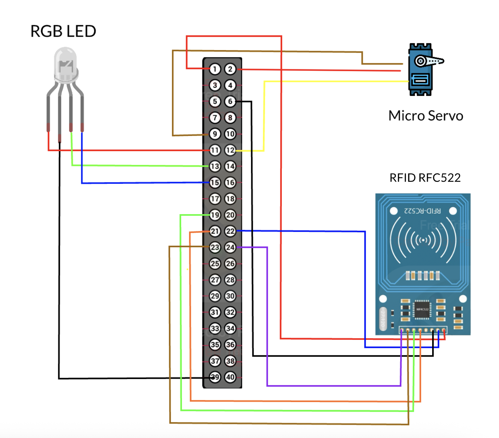

# KawaiiCon-Box-CTF-2025

# Overview

A challenge box for KawaiiCon 2025. Solve the challenges, get a prize.

Overall cost: $250

## Challenge 1 - Padlock Riddle

There are two ways to open the box - either you solve the puzzle and get the combo lock code, or you pick the other lock. Both open the first box. 

#### Puzzle

chain with 14 locks on them

each lock has a number + letter (each letter corresponds with the number of its place in alphabet e.g. A=1 B=2 ... Z=26 )

three sets of keyrings with 4 keys + label attached to each one

3 of the keys on each keyring has numbers on them

the label on each keyring has an encoded equation: 

1. addition:YWRkaXRpb24 (base64)

2. average:6927a3a7218a3195858411433ec20a21 (md5)

3. minimum:6D756D696E696D (reverse english to hexadecimal)

each keyring's solution corresponds with the number on the locks

e.g, keyring 1 has 3 keys with 1 2 3 on them. using the addition equation, you add 1 + 2 + 3 = 6

find the lock with 6 on it. the 4th key on the keyring will unlock this

open the lock, get correct letter 

3 correct locks have combo lock solution - A, E, F (156)

## Challenge 2 - Web Application

Have a local web server hosted on a Pi 4. Login portal vulnerable to SQLI via the session cookie, gets redirected to dashboard with loads of local IP addresses. 

Web application has three tabs; dashboard, cameras, and system. Users don't have permission to view the system panel. One tab contains the live camera feed.

Note that the camera scans QRCodes shown to it and retrieves the contents of the URL. Camera scanning is vulnerable to SSRF and can retrieve internal URLs. Grab contents of system panel and get code to the next combo lock.

## Challenge 3 - NFC Reader

Setup a vulnerable an NFC RFID reader that listens for specific UIDs and a piece of text stored on the tag/card that acts as a password. Return the correct information and the servo opens and light flashes green.

Light returns information based on the card you've scanned:

- Blue light = Waiting
- Red light = Wrong
- Purple light = Correct UID but wrong password
- Green light = Correct UID and correct password

Writing the password to the fob using the Mifare Classic app:

- Scan fob using Android phone
- Select "Read Tag"
- Select "START MAPPING AND READ TAG"
- Select the top line of 0's within Sector 2 and delete everything
- Convert password to hex and enter that within the top line of Sector 2
- Fill in the remaining space on the top line with 0's. Note, this is important
- Select the three dots in the top right corner and press "Write Dump"
- Select "Write Dump (Clone)" and click "WRITE DUMP"
- Ensure all checkboxes are checked
- Select "START MAPPING AND WRITE DUMP"
- Confirm if the correct password has been applied

## Bonus Challenges

There are two bonus challenges for those that pwn the entire Raspberry PI, each get an extra prize:

- A 'how_did_we_get_here.txt' flag in the root directory of the PI. Requires basic privilege escalation
- A secret second web application running on the PI that requires the user to pwn the PI and check out the running services. Returns flag upon navigating to service.

# Installation

If you fancy spinning up your own version of the electronics I've tried my best to include the steps and some infographics for easy setup.

### Materials Required:

- Raspberry Pi 4
- Raspberry Pi camera
- RFID-RFC522 NFC reader
- Mifare Classic 1k 13.56Mhz card or fob
- Plug to socket jumper leads
- Heat shrink
- Micro servo
- 20m copper wire
- Braided wire wrap
- Materials to create three boxes of varying size
- RGB light strip
- Speaker with aux capabilities

https://github.com/ikarus23/MifareClassicTool
https://play.google.com/store/apps/details?id=de.syss.MifareClassicTool
https://randomnerdtutorials.com/raspberry-pi-mjpeg-streaming-web-server-picamera2/

### Install project and dependencies:

Connect to the Raspberry Pi and install this repo + dependencies:

```bash
git clone git@github.com:Real4XoR/KawaiiCon-Box-CTF-2025.git && cd KawaiiCon-Box-CTF-2025
pip3 install -r requirements.txt
sudo apt install python3-pigpio
sudo apt install sqlite3
sudo apt install python3-opencv
```

### Setup 

Run the `setup.sh` script on the PI after installation. This script configures SSH access (MAKE SURE YOU ADD YOUR OWN PUBLIC SSH KEY TO THE FILE), firewall rules, hot-spot setup, and some other miscellaneous things. 

```bash
sudo chmod +x setup.sh
sudo ./setup.sh
```

### Running the Challenges

Due to the nature of how the Pi handles GPIO connections, they need to be managed and run in a certain way to ensure they are "cleaned" up correctly after you are finished. Otherwise you will have to reboot the Pi (boo).

In one terminal on the Pi run the below, this will be your live log for the NFC challenge and allow you to gracefully shut it down:

```bash
sudo chmod +x start.sh
sudo ./start.sh
```

In another run the below, this will be your live webapp log:

```bash
tail -f webapp.log
```

### Putting it all Together

Wire up the bits. I've included a Raspberry Pi 4 pin-out sheet and the wiring setup that I used.




# Prizes

- T-shirts
- Vouchers (TryHackMe (https://tryhackme.com/subscriptions), $17 p/month or HackTheBox, $20 USD p/month (https://www.hackthebox.com/giftcards))

# Credits

This is a continuation of Dunderhay's box project from 2019: https://github.com/dunderhay/Kawaiicon-Box-CTF-2019
